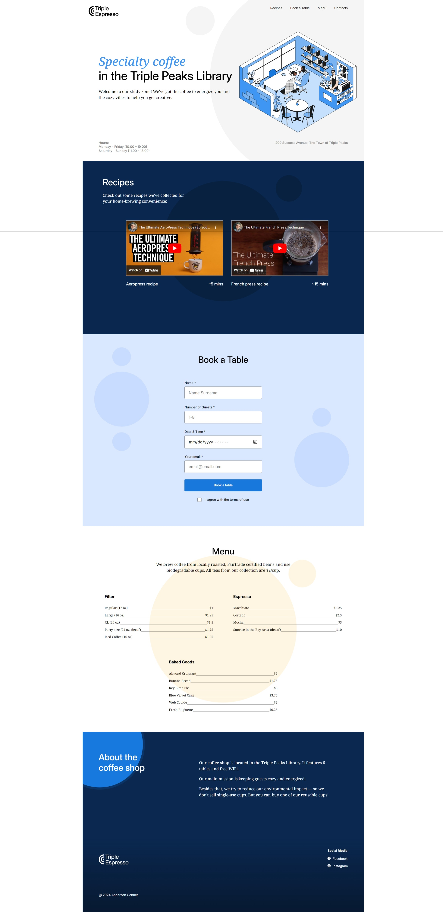

# Triple Peaks Coffee Shop

This is my second project of the Software Engineering program at TripleTen. It was created using HTML and CSS, based on the design brief.

## Project features

- Semantic HTML5
- Flexbox
- Positioning
- Flat BEM file structure
- A custom form
- CSS animation and transform

## Plans on improving the project

- I would like to add more recipes to the recipes section.
- More contacts in the footer like a phone number or an email.

## Screen Shot

